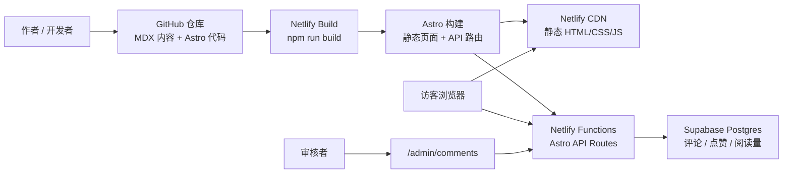
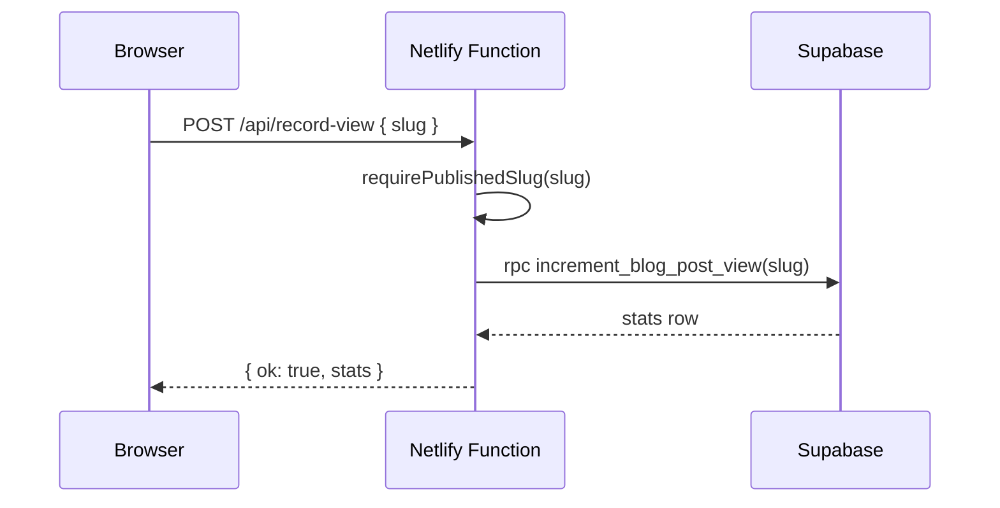
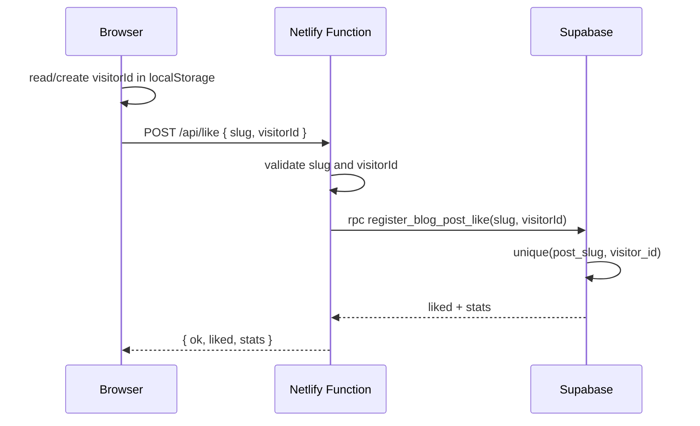
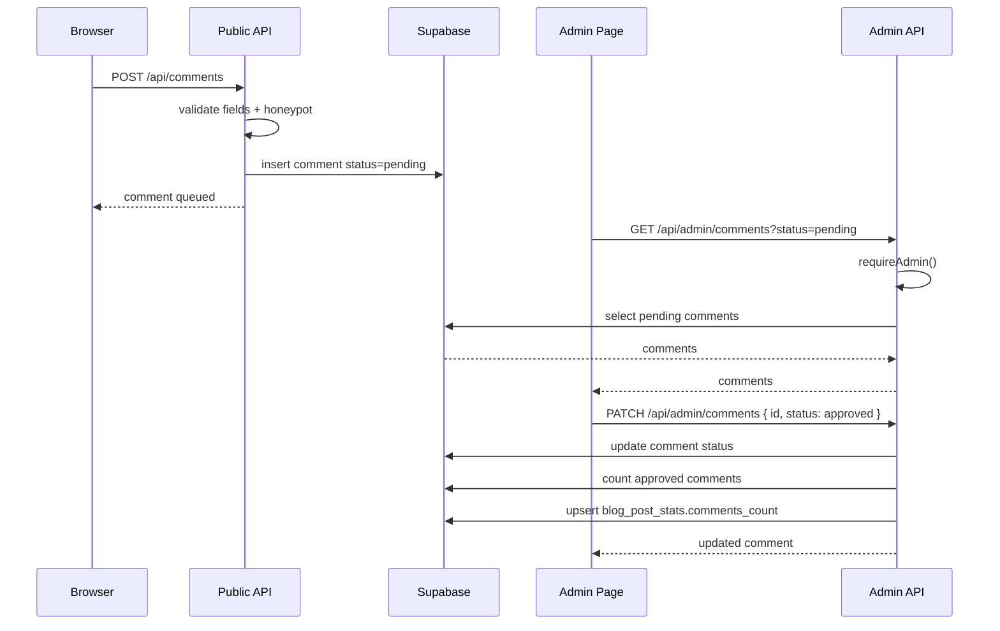

# 自然选择个人博客技术架构文档

版本：v1.0  
更新时间：2026-06-03  
站点：https://macondo-co.netlify.app  
仓库：`13810284349/Personal_Blog`

## 1. 背景与目标

“自然选择”是一个以阅读体验为核心的个人博客。系统采用静态优先架构：文章内容以 MDX 文件保存在 GitHub 仓库中，构建时由 Astro 生成静态页面；点赞、阅读量和评论等互动数据由 Supabase 承载；部署与服务端 API 运行在 Netlify 上。

首版目标：

- 让写作流程尽量接近“提交 Markdown/MDX 文件即发布”。
- 页面尽量静态化，降低运行成本，提高访问稳定性。
- 互动功能不引入完整用户体系，保留轻量评论审核。
- service role key 只存在于服务端运行环境，不进入浏览器端 bundle。
- 架构保持可扩展，后续可继续加入搜索、订阅、图片优化、自动部署等能力。

## 2. 总体架构



核心分层：

- 内容层：`src/content/posts/*.mdx`，由 Astro Content Collection 管理。
- 展示层：Astro pages、layouts、components，负责页面渲染和交互入口。
- API 层：`src/pages/api/*`，由 `@astrojs/netlify` 转换为 Netlify Functions。
- 数据层：Supabase Postgres，使用 RLS 和 service role 访问控制。
- 部署层：Netlify 运行构建、发布静态资源、承载函数。

## 3. 技术栈

| 领域 | 技术 | 用途 |
| --- | --- | --- |
| 框架 | Astro 6 | 静态页面、内容集合、API routes |
| 语言 | TypeScript | 页面脚本、服务端 API、类型检查 |
| 内容 | MDX | 文章正文与组件化内容 |
| 数据库 | Supabase Postgres | 阅读量、点赞、评论 |
| 数据访问 | `@supabase/supabase-js` | 服务端 API 访问 Supabase |
| 部署 | Netlify | 静态托管、构建、Functions |
| Adapter | `@astrojs/netlify` | 将 Astro API routes 映射为 Netlify Functions |

## 4. 运行模式

### 4.1 本地开发

```bash
npm install
npm run dev
```

本地开发使用 Astro dev server。`astro.config.mjs` 中通过 `process.argv.includes("dev")` 判断开发命令，本地 dev 时不启用 Netlify adapter，避免 Astro dev 与 adapter 本地行为冲突。

本地访问：

```text
http://127.0.0.1:4321/
```

如果需要更贴近 Netlify Functions 的本地环境，可后续引入 `netlify dev`，但当前常规开发以 `npm run dev` 为主。

### 4.2 生产构建

```bash
npm run build
```

实际执行：

```bash
ASTRO_TELEMETRY_DISABLED=1 astro check
ASTRO_TELEMETRY_DISABLED=1 astro build
```

生产构建启用 `@astrojs/netlify` adapter。页面主体静态预渲染到 `dist/`，显式设置 `prerender = false` 的 API routes 被打包为 Netlify Functions。

## 5. 仓库结构

```text
.
├── AGENTS.md
├── docs/
│   └── TECHNICAL_ARCHITECTURE.md
├── astro.config.mjs
├── netlify.toml
├── src/
│   ├── components/
│   │   ├── Comments.astro
│   │   ├── Engagement.astro
│   │   ├── PostList.astro
│   │   └── TagList.astro
│   ├── content/
│   │   └── posts/*.mdx
│   ├── layouts/
│   │   └── BaseLayout.astro
│   ├── lib/
│   │   ├── api.ts
│   │   ├── posts.ts
│   │   ├── site.ts
│   │   └── supabase.ts
│   ├── pages/
│   │   ├── api/
│   │   ├── posts/[slug].astro
│   │   ├── tags/
│   │   ├── about.astro
│   │   ├── index.astro
│   │   └── 404.astro
│   └── styles/
│       └── global.css
└── supabase/
    └── migrations/
```

## 6. 内容架构

文章通过 Astro Content Collection 管理，定义在 `src/content.config.ts`。

Frontmatter schema：

```yaml
title: "文章标题"
description: "文章摘要"
publishedAt: 2026-06-03
updatedAt: 2026-06-03
tags:
  - Astro
  - Supabase
draft: false
cover: "/cover.jpg"
```

字段说明：

| 字段 | 类型 | 必填 | 说明 |
| --- | --- | --- | --- |
| `title` | string | 是 | 文章标题 |
| `description` | string | 是 | 列表页和 SEO 摘要 |
| `publishedAt` | date | 是 | 发布时间 |
| `updatedAt` | date | 否 | 更新时间 |
| `tags` | string[] | 否 | 标签，默认空数组 |
| `draft` | boolean | 否 | 草稿标记，默认 `false` |
| `cover` | string | 否 | 公开可访问的封面路径或绝对 URL，用于文章详情页封面图、社交分享图、Article JSON-LD 图片和 RSS Media RSS 图片标签 |

内容读取逻辑集中在 `src/lib/posts.ts`：

- `getPublishedPosts()`：读取非草稿文章，并按发布时间倒序排列。
- `getPublishedPost(slug)`：按 slug 获取已发布文章。
- `getPublishedPostSlugs()`：获取所有已发布 slug。
- `isPublishedPostSlug(slug)`：API 层校验 slug 是否属于已发布文章。
- `getAllTags()`：聚合标签及文章数量。
- `readingTime(body)`：估算阅读时间。

草稿过滤是内容安全边界的一部分：列表、详情、API slug 校验均应只认已发布文章。

## 7. 页面架构

| 路由 | 文件 | 渲染方式 | 功能 |
| --- | --- | --- | --- |
| `/` | `src/pages/index.astro` | 静态 | 首页、文章列表 |
| `/posts/[slug]` | `src/pages/posts/[slug].astro` | 静态 | 文章详情、封面图、结构化 SEO、阅读量、点赞、评论 |
| `/tags` | `src/pages/tags/index.astro` | 静态 | 标签总览 |
| `/tags/[tag]` | `src/pages/tags/[tag].astro` | 静态 | 标签下文章列表 |
| `/about` | `src/pages/about.astro` | 静态 | 关于页 |
| `/admin/comments` | `src/pages/admin/comments.astro` | 静态 + 客户端 API | 评论审核界面 |
| `/404` | `src/pages/404.astro` | 静态 | 404 页面 |

全站布局在 `src/layouts/BaseLayout.astro` 中，包含：

- `<head>` 基础 meta、可选文章社交分享图 meta、article Open Graph 元数据和 `BlogPosting` JSON-LD。
- 页眉品牌：站点名、副标题。
- 主导航：文章、标签、关于、审核。
- 页面 slot。
- footer。

文章详情页的结构化 SEO 由 `src/pages/posts/[slug].astro` 组装数据，再交给 `BaseLayout` 输出：`dateModified` 使用 `updatedAt ?? publishedAt`，作者取 `site.author`，作者 URL 为站内 `/about`，标签映射为 repeated `article:tag`，有 `cover` 时同时写入 JSON-LD `image`。

站点级配置集中在 `src/lib/site.ts`：

```ts
export const site = {
  name: "自然选择",
  author: "YiYi",
  subtitle: "YiYi 的个人博客",
  description: "在技术、阅读和日常观察之间，保存一些缓慢但真实的判断。",
  nav: [...]
};
```

后续修改品牌、作者、导航时，应优先改这里，避免在页面中散落硬编码。

## 8. 前端交互架构

### 8.1 阅读量与点赞

组件：`src/components/Engagement.astro`

职责：

- 首次渲染展示阅读、喜欢、评论数占位。
- 页面加载后调用 `/api/record-view` 记录阅读。
- 随后调用 `/api/post-stats` 拉取最新统计。
- 点击“喜欢这篇”时调用 `/api/like`。
- 使用 `localStorage` 保存访客 ID 和当前文章 liked 状态。

本地存储 key：

```text
natural-selection-visitor-id
natural-selection-liked:<slug>
```

点赞去重有两层：

- 前端：本地 `likedKey` 阻止重复点击。
- 后端/数据库：`blog_post_likes` 上 `(post_slug, visitor_id)` 唯一约束兜底。

### 8.2 评论区

组件：`src/components/Comments.astro`

职责：

- 页面加载时调用 `/api/comments?slug=...` 获取已审核通过评论。
- 评论表单提交到 `POST /api/comments`。
- 评论提交成功后只提示“进入审核队列”，不会立即公开展示。
- 表单包含 honeypot 字段 `company`，用于拦截基础垃圾提交。

公开评论只包含：

- `id`
- `author_name`
- `author_website`
- `body`
- `created_at`

邮箱、IP hash、user agent 只保存在服务端，不返回给公开页面。

### 8.3 评论审核页

页面：`src/pages/admin/comments.astro`

职责：

- 管理者输入或配置 `BLOG_ADMIN_TOKEN` 后调用后台 API。
- 拉取 `pending`、`approved`、`rejected` 评论。
- 通过 `PATCH /api/admin/comments` 更新评论状态。

当前后台是轻量实现，不包含完整登录系统。安全边界依赖 `BLOG_ADMIN_TOKEN`。

## 9. API 架构

所有 API routes 都在 `src/pages/api/`，并设置：

```ts
export const prerender = false;
```

这表示它们不参与静态预渲染，而由 Netlify Functions 在运行时处理。

### 9.1 公共工具

`src/lib/api.ts` 提供：

- `json()`：统一 JSON Response。
- `errorJson()`：统一错误 Response。
- `normalizeSlug()`：slug 格式校验。
- `requirePublishedSlug()`：校验 slug 格式且属于已发布文章。
- `requireAdmin()`：校验 `Authorization: Bearer <BLOG_ADMIN_TOKEN>`。
- `readJsonObject()`：安全解析 JSON body。
- `cleanText()`、`cleanBody()`、`cleanOptionalEmail()`、`cleanOptionalUrl()`：输入清洗。

slug 规则：

```regex
^[a-z0-9][a-z0-9-]{0,100}$
```

### 9.2 API 清单

| API | 方法 | 鉴权 | 主要输入 | 主要行为 |
| --- | --- | --- | --- | --- |
| `/api/post-stats` | GET | 无 | `slugs=a,b` | 获取阅读、点赞、评论数 |
| `/api/record-view` | POST | 无 | `{ slug }` | 记录一次阅读 |
| `/api/like` | POST | 无 | `{ slug, visitorId }` | 注册点赞，重复点赞不增加计数 |
| `/api/comments` | GET | 无 | `slug` query | 读取 approved 评论 |
| `/api/comments` | POST | 无 | 评论表单 JSON | 新评论进入 pending |
| `/api/admin/comments` | GET | Bearer token | `status` query | 读取指定状态评论 |
| `/api/admin/comments` | PATCH | Bearer token | `{ id, status }` | 更新评论状态并刷新评论数 |

### 9.3 API 数据流

#### 阅读量



#### 点赞



#### 评论提交与审核



## 10. 数据库架构

数据库由 Supabase Postgres 承载。迁移文件位于 `supabase/migrations/`。

### 10.1 表结构

#### `blog_post_stats`

按文章 slug 聚合互动计数。

| 字段 | 类型 | 说明 |
| --- | --- | --- |
| `slug` | text primary key | 文章 slug |
| `views_count` | bigint | 阅读数，默认 0 |
| `likes_count` | bigint | 点赞数，默认 0 |
| `comments_count` | bigint | approved 评论数，默认 0 |
| `created_at` | timestamptz | 创建时间 |
| `updated_at` | timestamptz | 更新时间 |

#### `blog_post_likes`

记录某访客对某文章的点赞，用于去重。

| 字段 | 类型 | 说明 |
| --- | --- | --- |
| `id` | uuid primary key | 点赞记录 ID |
| `post_slug` | text | 关联 `blog_post_stats.slug` |
| `visitor_id` | text | 前端生成的匿名访客 ID |
| `created_at` | timestamptz | 创建时间 |

约束：

```sql
unique (post_slug, visitor_id)
```

#### `blog_comments`

记录评论及审核状态。

| 字段 | 类型 | 说明 |
| --- | --- | --- |
| `id` | uuid primary key | 评论 ID |
| `post_slug` | text | 关联文章 slug |
| `author_name` | text | 昵称 |
| `author_email` | text | 邮箱，不公开 |
| `author_website` | text | 个人网站，可公开 |
| `body` | text | 评论正文 |
| `status` | text | `pending` / `approved` / `rejected` |
| `user_agent` | text | 提交方 UA |
| `ip_hash` | text | 简单 hash 后 IP 标识 |
| `created_at` | timestamptz | 创建时间 |
| `reviewed_at` | timestamptz | 审核时间 |
| `updated_at` | timestamptz | 更新时间 |

### 10.2 索引

- `blog_post_likes_post_slug_idx`
- `blog_comments_post_status_created_idx`
- `blog_comments_status_created_idx`

这些索引用于：

- 按文章查询评论。
- 按状态拉取审核队列。
- 按文章统计 approved 评论数量。

### 10.3 函数与触发器

函数：

- `set_blog_updated_at()`：更新 `updated_at`。
- `increment_blog_post_view(p_slug text)`：原子增加阅读量。
- `register_blog_post_like(p_slug text, p_visitor_id text)`：原子注册点赞并返回是否为新增点赞。

触发器：

- `set_blog_post_stats_updated_at`
- `set_blog_comments_updated_at`

RPC 函数使用 `security definer`，并将执行权限限制到 `service_role`。

## 11. 安全架构

### 11.1 密钥边界

生产环境变量：

| 变量 | 可公开 | 用途 |
| --- | --- | --- |
| `SUPABASE_URL` | 可低敏公开 | Supabase 项目 URL |
| `SUPABASE_SERVICE_ROLE_KEY` | 否 | 服务端访问数据库 |
| `BLOG_ADMIN_TOKEN` | 否 | 评论审核 API 鉴权 |
| `PUBLIC_SITE_URL` | 是 | 公开站点 URL |

原则：

- 浏览器端不得读取或打包 `SUPABASE_SERVICE_ROLE_KEY`。
- `.env` 永不提交。
- 调试时只输出变量是否存在，不输出变量值。
- Netlify 环境变量修改后必须重新部署。

### 11.2 RLS 与权限

三张表均启用 RLS：

```sql
alter table ... enable row level security;
```

同时撤销 `anon` 和 `authenticated` 对表的直接访问权限。浏览器端不会直接使用 Supabase anon key 操作表，所有读写经 Netlify Functions 使用 service role 完成。

这样做的好处：

- 前端无法绕过 API 直接写数据库。
- 可以在 API 层统一校验 slug、字段长度、审核权限。
- 后续如引入登录系统，可逐步添加更细粒度 policy。

### 11.3 输入校验

API 层校验包括：

- slug 格式和已发布状态。
- 评论昵称、正文长度。
- email 格式。
- URL 协议必须为 `http:` 或 `https:`。
- visitor id 长度和字符集。
- admin token 完全匹配。

评论正文使用 `textContent` 渲染，不直接插入 HTML，降低 XSS 风险。

### 11.4 当前安全限制

当前版本仍有几个有意识的轻量化取舍：

- `hashIp()` 是简单 hash，不是加盐密码学 hash，不适合作为强匿名化方案。
- 评论防滥用只有 honeypot 和审核队列，没有验证码、频率限制或 WAF 规则。
- 后台审核是 token 模式，不是完整用户登录。

如果访问量增加，应优先补充：

- IP hash 加盐或更稳妥的匿名化策略。
- 评论提交频率限制。
- Netlify/Vercel 风格的 server-side rate limit 或边缘防护。
- 正式身份认证。

## 12. 部署架构

### 12.1 Netlify 配置

`netlify.toml`：

```toml
[build]
command = "npm run build"
publish = "dist"

[build.environment]
NODE_VERSION = "22"
```

安全 headers：

```toml
X-Frame-Options = "DENY"
X-Content-Type-Options = "nosniff"
Referrer-Policy = "strict-origin-when-cross-origin"
```

### 12.2 Astro adapter 行为

`@astrojs/netlify` 在生产构建时负责：

- 收集 Astro API routes。
- 生成 Netlify Function bundle。
- 写出 Netlify 所需的 redirects/config。
- 将静态页面和函数一起交给 Netlify 发布。

当前配置：

```js
const isDevCommand = process.argv.includes("dev");

export default defineConfig({
  output: "static",
  adapter: isDevCommand ? undefined : netlify(),
  integrations: [mdx()]
});
```

解释：

- 页面以静态输出为主。
- 本地 `astro dev` 不启用 adapter。
- 生产构建启用 adapter，以支持 `prerender = false` 的 API routes。

### 12.3 部署流程

推荐流程：

```bash
npm run check
npm run build
git status --short
git add <files>
git commit -m "..."
git push origin main
```

如果 Netlify 未连接 GitHub 自动部署，手动部署时必须使用不含 `.env` 的干净临时 clone 或等价方式，避免上传本地密钥文件。

部署后验证：

```bash
curl -L https://macondo-co.netlify.app/
curl -L https://macondo-co.netlify.app/about
```

并手工检查：

- 首页文章列表。
- 文章详情页。
- 阅读量是否更新。
- 点赞是否只计一次。
- 评论提交是否进入待审核。
- 未带 token 的后台 API 是否返回 401。

## 13. 性能与缓存

当前性能策略：

- 文章、首页、标签页、关于页均静态预渲染，天然适合 CDN 缓存。
- 互动数据通过小型 JSON API 异步加载，不阻塞文章正文展示。
- CSS 集中在 `src/styles/global.css`，避免复杂运行时样式方案。
- 不引入客户端框架，页面 JavaScript 只用于必要互动。

潜在优化方向：

- 增加 RSS。
- 增加全文搜索索引。
- 图片引入 Netlify Image CDN 或 Astro assets。
- 对 `/api/post-stats` 做短缓存或批量请求优化。
- 增加构建产物体积检查。

## 14. 可观测性与故障排查

常见故障路径：

| 现象 | 优先检查 |
| --- | --- |
| 页面 404 | Astro 路由、文章 slug、Netlify deploy 是否最新 |
| API 500 | Netlify Function logs、Supabase 环境变量是否存在 |
| 点赞不增加 | visitor id、唯一约束、RPC 权限 |
| 评论不展示 | 评论是否 approved、comments_count 是否刷新 |
| 后台 401 | `BLOG_ADMIN_TOKEN` 是否配置、Authorization header 是否正确 |
| 构建失败 | `npm run build`、Astro content schema、Netlify Node 版本 |

建议排查顺序：

1. 本地运行 `npm run check`。
2. 本地运行 `npm run build`。
3. 检查 Netlify deploy logs。
4. 检查 Netlify 环境变量是否存在。
5. 检查 Supabase 表、RLS、RPC 权限。

## 15. 演进路线

短期可做：

- 连接 GitHub 到 Netlify，实现 push 后自动部署。
- 增加 RSS feed 和 sitemap。
- 增加文章归档页。
- 增加评论审核状态筛选和搜索。
- 给 API 增加更细的错误日志。

中期可做：

- 使用 Supabase Edge Functions 或 Netlify Scheduled Functions 做统计归档。
- 引入搜索，如 Pagefind。
- 对评论增加 rate limit。
- 引入图片资源管理和自动压缩。
- 增加 Open Graph 图片。

长期可做：

- 独立后台 CMS。
- 多作者。
- 邮件订阅。
- 登录态与更细粒度权限。
- 内容版本、预览和草稿工作流。

## 16. 变更清单模板

每次较大改动建议在提交说明或 PR 描述中包含：

```markdown
## Summary
- 

## Changed
- 

## Validation
- [ ] npm run check
- [ ] npm run build
- [ ] 本地页面检查
- [ ] 线上部署检查

## Security
- [ ] 未提交 .env 或真实密钥
- [ ] 未将 service role key 暴露到浏览器端
```

## 17. 当前架构判断

当前架构适合个人博客首版：静态内容与少量动态互动被清晰分离，维护成本低，部署路径短，安全边界相对明确。最大风险点不在页面渲染，而在密钥管理、评论滥用和手动部署流程。后续应优先完成 GitHub 自动部署、密钥轮换、评论限流和日志观测。
